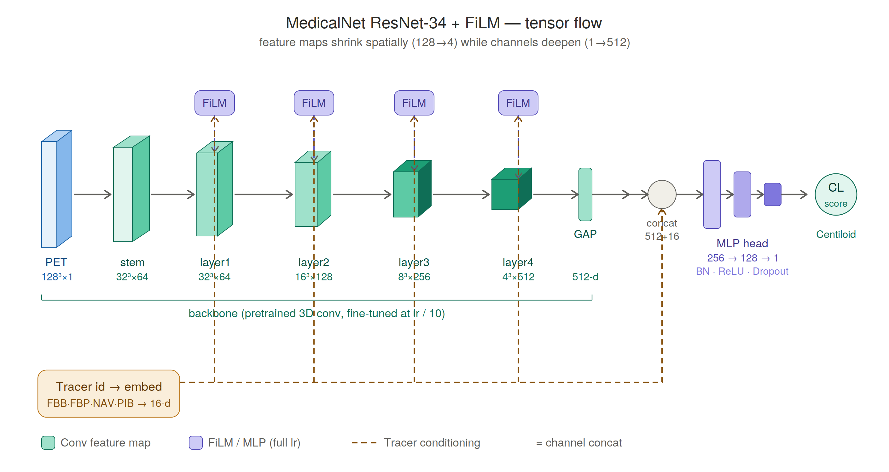
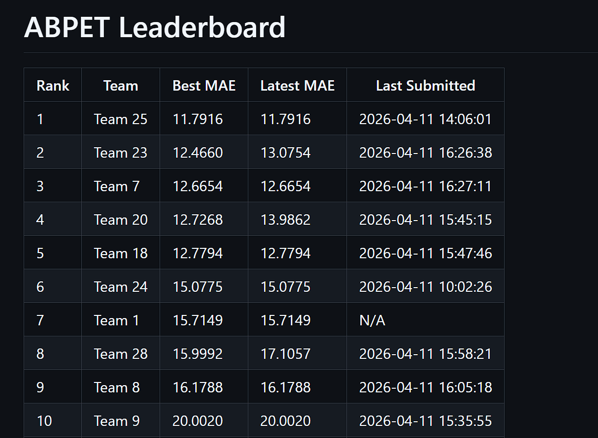
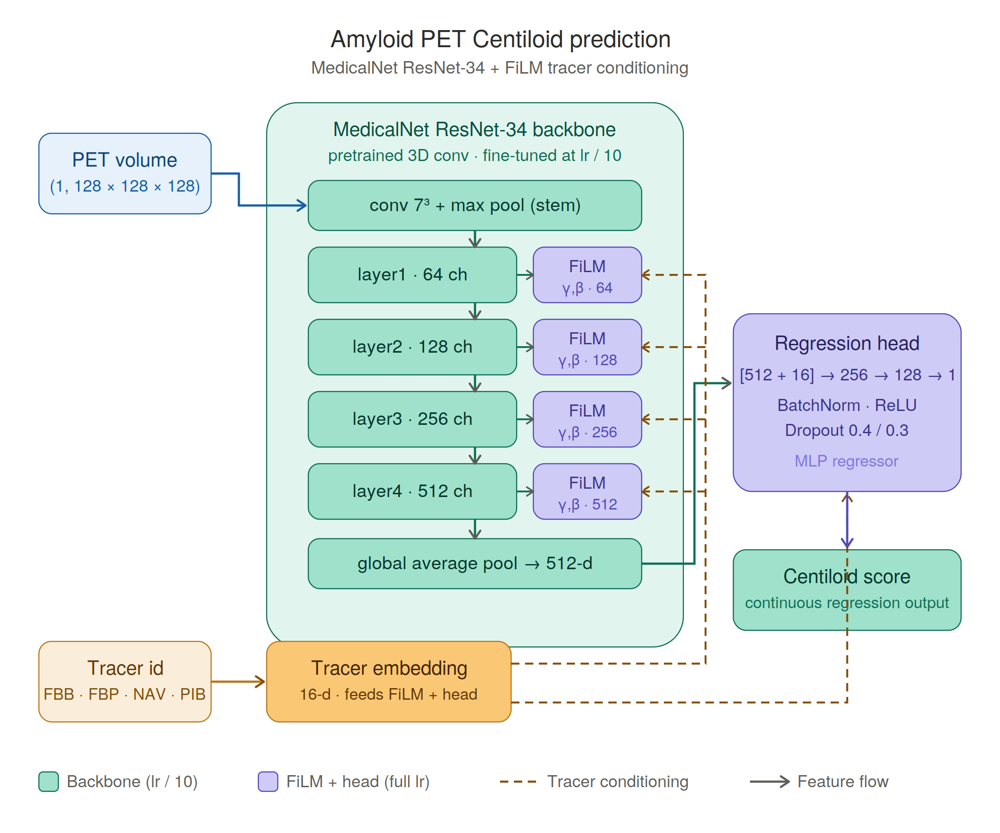
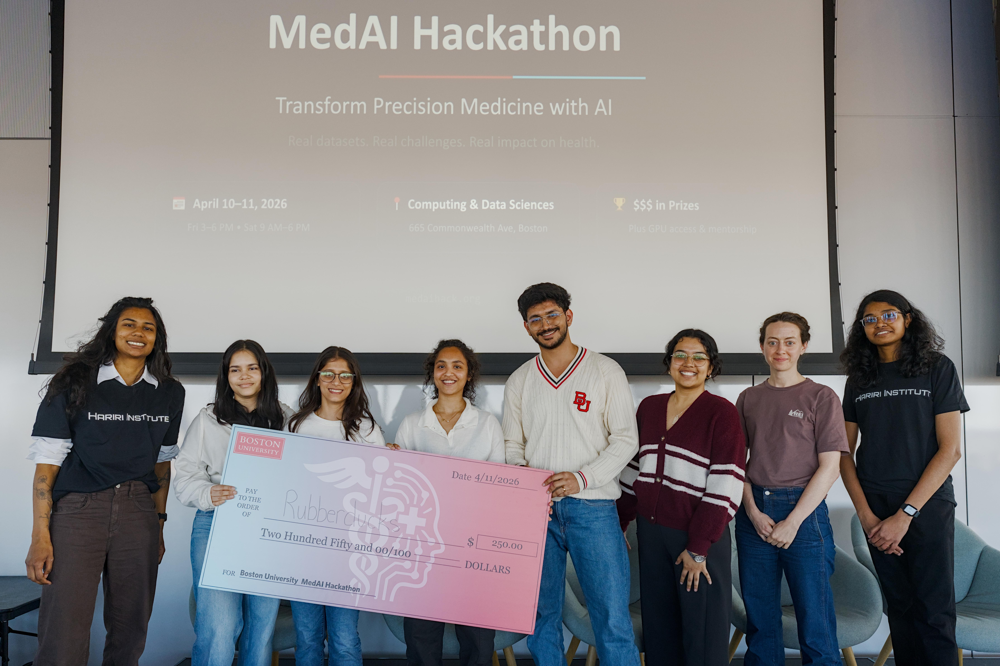

<h1 align="center">Amyloid PET Centiloid Prediction</h1>

<p align="center">
  3D MedicalNet ResNet-34 + FiLM tracer conditioning for amyloid β-PET Centiloid regression
</p>

<p align="center">
  <b>3rd place</b> at the
  <a href="https://medaihack.org/"><b>MedAI Spring 2026 Hackathon</b></a>
  (Challenge 2), organized by the
  <a href="https://github.com/vkola-lab/medaihack"><b>Kolachalama Lab, Boston University</b></a>.
</p>

<p align="center">
  <b>Team 7</b><br/>
  Aryan Meena · Khushi Teli · Navya D. · Kaveri Goel · Kelsey S · Astika Tyagi 
</p>

<p align="center">
  
  
  
  
</p>

---

We predict continuous **Centiloid scores** directly from preprocessed 3D amyloid β-PET
volumes (`(1, 128, 128, 128)`, four tracers: **FBB**, **FBP**, **NAV**, **PIB**), trained on
the MedAI Spring 2026 Hackathon Challenge 2 data (2,000 train + 500 val, NACC + A4 cohorts).
The Centiloid scale is the standardized quantitative measure of brain amyloid burden — a key
biomarker in Alzheimer's research — and automating it from raw PET volumes removes a manual,
region-of-interest-based bottleneck.

> **Validation set (n = 500):** MAE **7.31 CL**, Pearson r **0.968**. \
> **External test set (final leaderboard):** MAE **12.67 CL** — **3rd place** of all competing teams.

<p align="center">
  
</p>

Our model combines:
- a **3D MedicalNet ResNet-34** backbone (pretrained 3D conv weights), fine-tuned gently at `lr/10`;
- **FiLM** (Feature-wise Linear Modulation) conditioning after every residual stage — per-tracer
  learned `(γ, β)`, initialized to identity so training starts equivalent to no conditioning;
- a **tracer embedding** concatenated into a 3-layer MLP regression head;
- a **Huber loss** (`δ = 15`) for robustness to the heavy right tail of the Centiloid distribution,
  trained with AMP, cosine-annealed LR, and gradient clipping.

A single shared backbone generalizes across all four tracers, rather than training four separate models.

---

## Contents

1. [Results](#results)
2. [Architecture](#architecture)
3. [Quick start](#quick-start)
4. [Repository structure](#repository-structure)
5. [Data](#data)
6. [What we learned](#what-we-learned)
7. [The team](#the-team)
8. [Disclaimer](#disclaimer)
9. [License](#license)
10. [References](#references)

---

## Results

Evaluated on the 500-subject validation split and the held-out external test set.

| Metric | Value |
|--------|-------|
| Validation MAE (n = 500) | **7.31 CL** |
| Validation Pearson r | **0.968** |
| External test MAE (final leaderboard) | **12.67 CL** |
| Placement | **3rd place** |

**Per-tracer validation breakdown** (from `results/val_report_*.csv`):

| Tracer | N | MAE (CL) | Pearson r |
|--------|---|----------|-----------|
| **ALL** | 500 | **7.31** | **0.968** |
| FBB | 114 | 7.09 | 0.973 |
| FBP | 236 | 7.77 | 0.963 |
| NAV | 17 | 5.02 | 0.985 |
| PIB | 133 | 6.96 | 0.969 |

> Consistent accuracy across all four tracers — including NAV (n = 17), the rarest —
> indicates the FiLM + tracer-embedding conditioning generalizes rather than overfitting
> the dominant tracers.

<p align="center">
  
</p>

---

## Architecture

```text
Input: (B, 1, 128, 128, 128) + tracer_id (B,)
          │
          ▼
    Stem: Conv3d(1→64, 7³, s=2) → BN → ReLU → MaxPool3d(s=2)
          │                                                   Tracer embedding
          ▼                                                       (n_tracers → 16)
    layer1: BasicBlock×3        → FiLM  →  (B,  64, 32³)  ◄──┤
    layer2: BasicBlock×4 (s=2)  → FiLM  →  (B, 128, 16³)  ◄──┤
    layer3: BasicBlock×6 (s=2)  → FiLM  →  (B, 256,  8³)  ◄──┤
    layer4: BasicBlock×3 (s=2)  → FiLM  →  (B, 512,  4³)  ◄──┘
          │
          ▼
    Global average pool  →  (B, 512)
          │
          ▼
    Concat[image_feat ‖ tracer_emb]  →  (B, 528)
          │
          ▼
    Linear(528→256) → BN → ReLU → Dropout(0.4)
    Linear(256→128) → BN → ReLU → Dropout(0.3)
    Linear(128→  1)   ← linear (CL can be negative)
          │
          ▼
    Centiloid prediction (B,)
```

**Backbone:** MedicalNet 3D ResNet-34, layers `[3, 4, 6, 3]` with `BasicBlock`, pretrained
3D convolutional weights loaded with non-strict matching.

**Loss:** Huber (`δ = 15`) — robust to outlier Centiloid values vs. plain MSE.

**Training**
- **Optimizer:** AdamW (weight decay 1e-3) with two learning-rate groups — backbone at `lr/10`,
  FiLM + tracer embedding + head at full `lr` (default `3e-4`).
- **Scheduler:** CosineAnnealingLR (`eta_min = 1e-7`).
- **Precision:** automatic mixed precision (AMP) via `torch.amp`.
- **Gradient clipping:** max norm 1.0.
- **Early stopping:** patience on validation MAE; best checkpoint saved to `checkpoints/best_model.pt`.
- `torch.compile` enabled when available for fused kernels.

A block/system view of the same architecture is available below.

<details>
<summary>Block diagram</summary>

<p align="center">
  
</p>

</details>

---

## Quick start

```bash
pip install -r requirements.txt

# Train
python src/train_v3.py \
    --train_csv data/train.csv \
    --val_csv   data/val.csv \
    --pretrained weights/resnet_34.pth \
    --loss huber --patience 10

# Predict (judge entry point)
bash predict.sh data/val.csv checkpoints/best_model.pt predictions.csv
```

`predict.sh` activates the team virtual environment, then calls `predict_v4.py` with the
provided CSV and checkpoint. The output `predictions.csv` contains `ID`, `npy_path`,
`TRACER.AMY`, and `PREDICTED_CENTILOIDS` columns.

---

## Repository structure

```text
medai-amyloid/
├── src/
│   ├── model_v3.py      MedicalNet ResNet-34 backbone + FiLM + regression head
│   ├── train_v3.py      training loop (AMP, dual-LR AdamW, cosine LR, early stopping)
│   ├── predict_v4.py    inference → predictions.csv
│   └── losses_v1.py     get_criterion: mse / mae / huber
├── notebooks/
│   └── visualize_pet.ipynb   axial / coronal / sagittal slices + prediction
├── results/
│   ├── metrics_*.csv         per-epoch: train_loss, val_mae, val_corr, lr
│   └── val_report_*.csv      overall + per-tracer MAE / Pearson r
├── assets/              architecture diagrams, leaderboard, team photo
├── predict.sh           evaluation entry point
├── requirements.txt
├── LICENSE
└── README.md
```

---

## Data

| Split | Cohorts | N |
|-------|---------|---|
| Train | NACC + A4 | 2,000 |
| Val   | NACC + A4 | 500 |

Each sample is a preprocessed `(1, 128, 128, 128)` float32 `.npy` volume in range `[0, 1]`,
with an associated Centiloid score and tracer label (`FBB`, `FBP`, `NAV`, `PIB`). Each tracer
binds amyloid with different affinity and produces different uptake patterns; the Centiloid scale
harmonizes the *target* across tracers, but the raw images still differ — which is exactly what the
FiLM + tracer-embedding conditioning is there to handle. All preprocessing (resampling, cropping,
resize to 128³, intensity normalization) was provided by the organizers and applied upstream.

---

## What we learned

A single shared backbone with lightweight per-tracer **conditioning (FiLM)** beat the obvious
approach of training one model per tracer — it pools data across all four while still adapting to
each tracer's intensity profile, which matters most for the rare tracers (NAV, n = 17).

The gap between **validation MAE (7.31)** and **test MAE (12.67)** was the real lesson: the held-out
external set exposed distribution shift that internal validation underestimated. A robust loss
(Huber), dropout, weight decay, and not over-tuning to the validation split mattered more than
squeezing the architecture.

---

## The team

<p align="center">
  
</p>
<p align="center"><em>Team 7 — BU MedAI Spring 2026 Hackathon · 3rd place</em></p>

---

## Disclaimer

This software and any trained weights are provided **for academic and research purposes only**.
They are **not a medical device** and have not been validated or approved by the FDA, EMA, or any
other regulatory body. The model and its predictions must not be used to inform clinical diagnosis,
treatment, prognosis, or any patient-care workflow. The training data (2,000 hackathon samples
across four tracers) is too small and narrow to support any clinical claim, and the model has
undergone no prospective or external clinical validation.

---

## License

Released under the **MIT License** — see [`LICENSE`](LICENSE).

---

## References

Foundational work that informed the architecture and training.

1. **He K, Zhang X, Ren S, Sun J.** Deep Residual Learning for Image Recognition. *CVPR* 2016.
   [arXiv:1512.03385](https://arxiv.org/abs/1512.03385)
2. **Chen S, Ma K, Zheng Y.** Med3D: Transfer Learning for 3D Medical Image Analysis (MedicalNet). 2019.
   [arXiv:1904.00625](https://arxiv.org/abs/1904.00625)
3. **Perez E, Strub F, de Vries H, Dumoulin V, Courville A.** FiLM: Visual Reasoning with a General
   Conditioning Layer. *AAAI* 2018. [arXiv:1709.07871](https://arxiv.org/abs/1709.07871)
4. **Loshchilov I, Hutter F.** Decoupled Weight Decay Regularization (AdamW). *ICLR* 2019.
   [arXiv:1711.05101](https://arxiv.org/abs/1711.05101)
5. **Micikevicius P, et al.** Mixed Precision Training. *ICLR* 2018.
   [arXiv:1710.03740](https://arxiv.org/abs/1710.03740)
6. **Klunk WE, et al.** The Centiloid Project: standardizing quantitative amyloid plaque estimation
   by PET. *Alzheimer's & Dementia* 2015;11(1):1–15.
   [doi:10.1016/j.jalz.2014.07.003](https://doi.org/10.1016/j.jalz.2014.07.003)

---

**Aryan Meena** · [LinkedIn](https://linkedin.com/in/aryan-meena-32685415a) · araj7042@gmail.com
Boston University · MedAI Spring 2026 Hackathon
